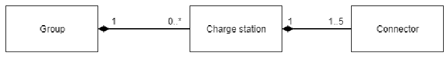

# Electric Vehicle Charge Station Management API

## Overview
An example of a RESTful API done using ASP.net Core and Azure Cosmos.

This API exposes a simplified EV charge station management domain. 

Domain Model:

- **Group**: has a unique Identifier (cannot be changed), Name (can be changed), Capacity in Amps
(integer, value greater than zero, can be changed). A Group can contain multiple charge stations.
- **Charge station**: has a unique Identifier (cannot be changed), Name (can be changed), and Connectors
(at least one, but not more than 5).
- **Connector**: has integer Identifier unique within the context of a charge station with (possible range
of values from 1 to 5), Max current in Amps (integer, value greater than zero, can be changed).

Manage Groups with the _/groups/_ route.

Manage Charge Stations with the _/groups/{groupId}/stations/_ route.

Manage Connectors with the _/groups/{groupId}/stations/{stationId}/connectors_ route.

Alternatively, you can also add or update connectors directly when adding or updating Charge Stations.

## How To Run API Locally
### Pre-requisites
1. .NET Core (+SDK) 7.0 or higher. [Download here](https://dotnet.microsoft.com/en-us/download).

### Step by step
1. Execute the _run.sh_ shell script located at the root folder of the repo. Alternatively you can run `dotnet run --project src/SmartCharging.Api --launch-profile http` in your terminal or console.
1. The API will be exposed at localhost:5094. Go to http://localhost:5094/swagger/index.html to open Swagger UI.

## Run Integration Tests Locally
### Pre-requisites
1. .NET Core (+SDK) 7.0 or higher. [Download here](https://dotnet.microsoft.com/en-us/download).
1. Azure Cosmos DB Emulator. [Download here](https://aka.ms/cosmosdb-emulator).

### Step by step
1. Go to src/SmartCharging.IntegrationTests/LiveFixture.cs and on `serviceCollection.Configure<DatabaseSettings>(...)` add your Comos DB Emulator's host uri and primary key (AccountEndpoint and AuthKey respectively).
1. Execute the _test.sh_ shell script located at the root folder of the repo. Alternatively you can run `dotnet test` in your terminal or console.
1. The results should display on your console.
